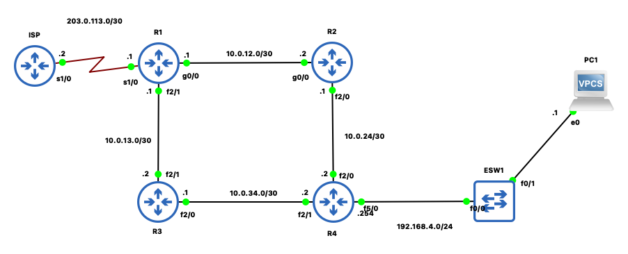

# OSPF Lab – CCNA 200-301  
**Author:** Mugisha Loic  

---

##  Objective  
- Configure and verify OSPF on 4 routers  
- Ensure proper routing between all networks  
- Use clean subnetting and assign proper router IDs.
- Set interfaces that aren't facing other routers 

---

## Topology Overview  




---
## Pre-Configuration Summary  
Before enabling OSPF, the following configurations were completed on all routers:
- Assigned hostnames (`R1`, `R2`, `R3`)
- Configured interface IP addresses and subnet masks
- Added loopback interfaces for router ID purposes
- Verified basic connectivity using `ping`
## 📚 Lab Details  

| Device | Interfaces | IP Addresses              | Loopback Address |
|--------|------------|---------------------------|------------------|
| R1     | G0/0, G0/1 | 192.168.10.1 / 10.0.0.1   |  1.1.1.1         |
| R2     | G0/0, G0/1 | 10.0.0.2 / 172.16.0.1     |  2.2.2.2         |
| R3     | G0/0       | 172.16.0.2                |                  |
| R4     |            |                           |                  |
> Each router connects to two directly connected networks and runs OSPF process ID 1.

---

## ⚙️ OSPF Configuration Snippets

### 🔹 R1 OSPF
```bash
router ospf 1
 network 192.168.10.0 0.0.0.255 area 0
 network 10.0.0.0 0.0.0.3 area 0
